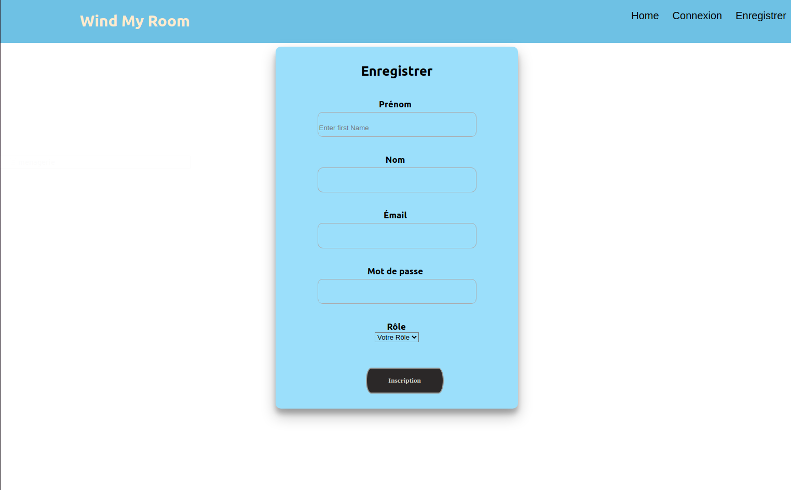

# 🚀 Wind my roof

### Table of Contents

- [Description](#description)
- [How To Use](#how-to-use)
- [Contributor](#contributor)

---

## 📖 Description

Wind my roof is a **full stack** project made with React it consist of signup and login with different roles like Admin and User

#### 🔬 Technologies

    
    
    
    

## How To Use

#### ⚙️ Installation

1.  Initialisation of a package.json

            yarn init

2.  Installation of modules

            React:
            npx create-react-app my-app
            cd my-app
            yarn start

            Other dependencies:
            yarn install react-dom
            yarn install react-router-dom
            yarn install react-toastif
            yarn install axios
            yarn install cors
            yarn install nodemon

## Contributors

-<spam>Filmon Saere</spam> [][github]

 
 

[github]: https://github.com/filmons